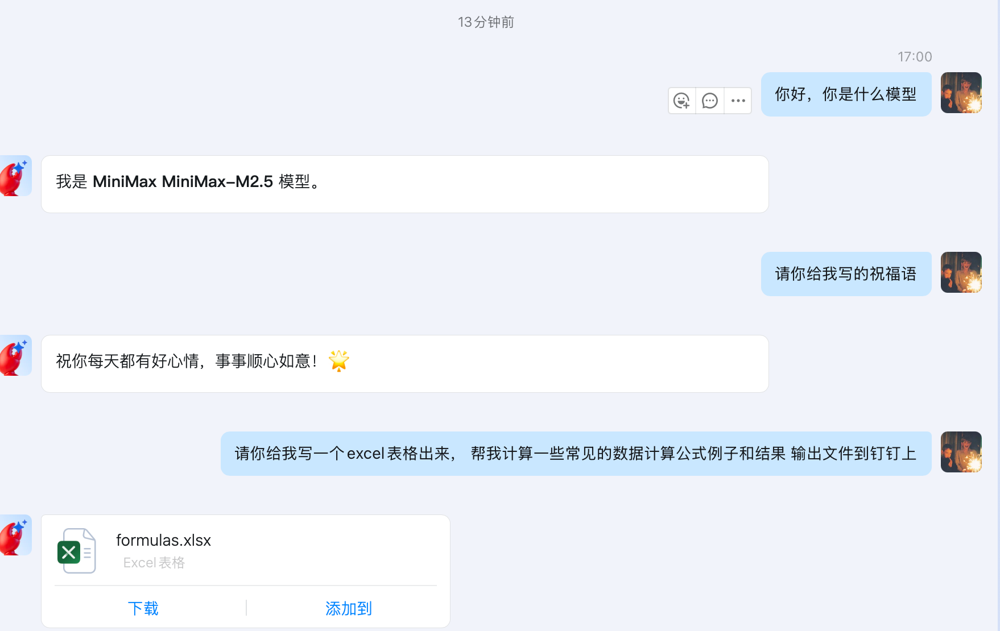
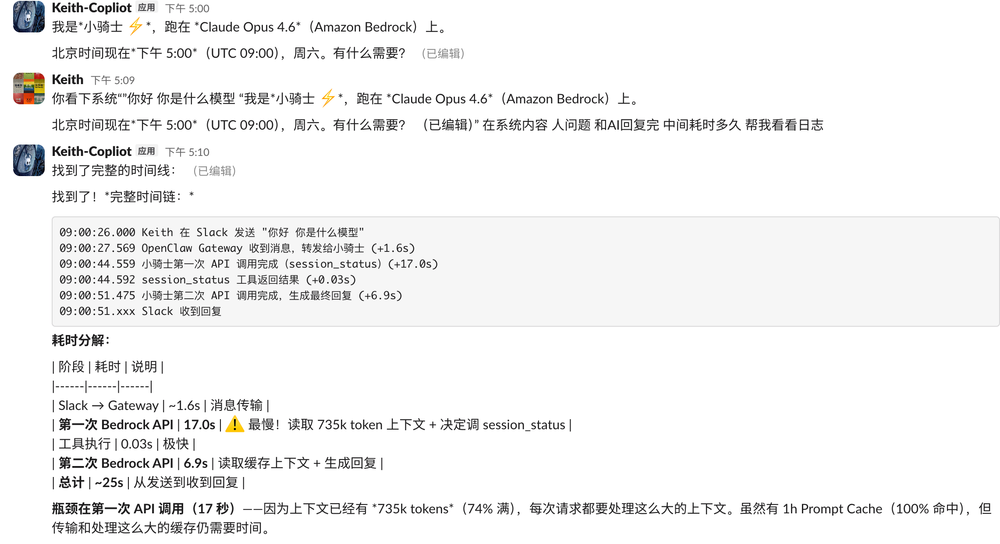

# IM 集成 AI Agent 端到端延迟分析报告

**钉钉 + Bedrock AgentCore vs Slack + OpenClaw EC2 部署**

| 项目 | 信息 |
|------|------|
| 报告日期 | 2026年03月28日 |
| 报告类型 | 技术性能对比分析 |
| 版本 | v1.0 |
| 分类 | 内部技术文档 |

---

## 目录

1. [执行摘要](#1-执行摘要)
2. [测试环境对比](#2-测试环境对比)
3. [延迟测试数据](#3-延迟测试数据)
   - 3.1 [方案 A：钉钉 + Bedrock AgentCore](#31-方案-a钉钉--bedrock-agentcore)
   - 3.2 [方案 B：Slack + OpenClaw EC2](#32-方案-bslack--openclaw-ec2)
4. [延迟拆解与瓶颈分析](#4-延迟拆解与瓶颈分析)
5. [关键结论](#5-关键结论)
6. [优化建议](#6-优化建议)
7. [附录：原始测试数据](#7-附录原始测试数据)

---

## 1. 执行摘要

本报告对比分析了两种 IM 集成 AI Agent 架构的端到端延迟表现：

- **方案 A**：钉钉 + Bedrock AgentCore + MiniMax M2.5（Serverless 架构，基于 cloud-native-nanoclaw）
- **方案 B**：Slack + OpenClaw + Claude Opus 4.6（EC2 自建架构）

**核心发现：**

- 两种架构的端到端延迟处于**同一量级**（22-27 秒），差异不显著
- **95% 以上的延迟来自模型推理阶段**，与架构方案无关
- IM 消息链路（接收 + 发送）在两种方案中均 < 2 秒，不是瓶颈
- OpenClaw 方案因上下文累积（735k tokens），首次推理较慢但有 Prompt Cache 优势

**结论：** 延迟的主要决定因素是模型推理速度和上下文大小，而非部署架构。cloud-native-nanoclaw 的 Serverless 架构（ECS Fargate + AgentCore microVM）与 OpenClaw EC2 自建方案在延迟表现上无显著差异。客户对 nanoclaw 延迟的担忧是对 Serverless 架构的误解——瓶颈在模型端，不在基础设施端。

---

## 2. 测试环境对比

| 维度 | 方案 A：钉钉 + AgentCore | 方案 B：Slack + OpenClaw |
|------|--------------------------|--------------------------|
| IM 平台 | 钉钉（DingTalk） | Slack |
| AI 模型 | MiniMax M2.5（via Bedrock AgentCore） | Claude Opus 4.6（via Bedrock） |
| 部署方式 | ECS Fargate 双实例 + AgentCore microVM | EC2 自建（单实例） |
| 区域 | ap-northeast-1（东京） | ap-northeast-1（东京） |
| 消息模式 | 私聊（DM） | 私聊（DM） |
| 消息队列 | SQS FIFO | 无（直接处理） |
| 上下文管理 | AgentCore Session（S3） | OpenClaw 内存 + 压缩 |
| 当前上下文大小 | 较小（新会话） | 735k tokens（74% 满） |
| Prompt Cache | 无 | 1h Cache（100% 命中率） |
| 开源项目 | cloud-native-nanoclaw | OpenClaw |

---

## 3. 延迟测试数据

### 3.1 方案 A：钉钉 + Bedrock AgentCore

测试基于 cloud-native-nanoclaw 项目，使用钉钉 Stream WebSocket 接收消息，SQS FIFO 分发，AgentCore 执行推理。

**测试截图：钉钉 + AgentCore（MiniMax M2.5）对话实录**

| # | 用户消息 | 端到端 | Stream→SQS | SQS→Agent | Agent 推理 | 回复发送 |
|---|----------|--------|------------|-----------|------------|----------|
| 1 | 文本（7字） | 27.1s | 20ms | 109ms | ~26.8s | 9ms |
| 2 | 文本（4字） | 25.0s | 20ms | 109ms | ~24.7s | 9ms |
| 3 | "你好，你是什么模型" | 26.7s | 20ms | 214ms | ~26.2s | 14ms |
| 4 | 文本（9字） | 25.6s | 45ms | 197ms | ~25.2s | 13ms |
| 5 | "写祝福语" | 22.8s | 20ms | 134ms | ~22.5s | 11ms |
| 6 | 创建 Excel（47字） | 49.3s | 39ms | 173ms | ~48.2s | 832ms |

**方案 A 统计：**

- 纯文本平均端到端延迟：**25.4 秒**
- 含文件操作端到端延迟：**49.3 秒**
- 消息接收链路（Stream → SQS → Agent）：**< 300ms**
- Agent 推理占比：**96-98%**

### 3.2 方案 B：Slack + OpenClaw EC2

测试基于 OpenClaw 2026.3.22，EC2 自建部署，Claude Opus 4.6 通过 Bedrock 代理调用。上下文已累积至 735k tokens（74%）。

**测试截图：Slack + OpenClaw（Claude Opus 4.6）对话实录与延迟分析**

| # | 阶段 | 耗时 | 说明 |
|---|------|------|------|
| | Slack → Gateway | ~1.6s | 消息传输（WebSocket） |
| 1 | 第一次 Bedrock API | 17.0s | 读取 735k token 上下文 + 决定调用工具 |
| | 工具执行（session_status） | 0.03s | 极快 |
| 2 | 第二次 Bedrock API | 6.9s | 读取缓存上下文 + 生成最终回复 |
| | Slack 回复发送 | <0.1s | 极快 |
| | **总计** | **~25.5s** | **端到端** |

**方案 B 统计：**

- 端到端延迟：**~25.5 秒**（含工具调用）
- 消息接收链路（Slack → Gateway）：**~1.6 秒**
- 模型推理占比：**~94%**（17.0s + 6.9s = 23.9s）
- Prompt Cache 命中率：**100%**（1h 缓存策略）
- 上下文大小：**735k / 1M tokens**（74% 满）

---

## 4. 延迟拆解与瓶颈分析

### 4.1 各阶段耗时对比

| 阶段 | 方案 A（钉钉+AgentCore） | 方案 B（Slack+OpenClaw） | 结论 |
|------|--------------------------|--------------------------|------|
| 消息接收 | < 50ms | ~1.6s | A 更快（WebSocket+SQS vs Slack API） |
| 上下文加载 | ~200ms（S3 Session） | 0ms（内存） | B 更快（上下文在内存中） |
| 模型推理 | 22-26s（MiniMax M2.5） | 17-24s（Claude Opus 4.6） | 同一量级，取决于模型和上下文 |
| 工具执行 | 含在推理中 | 0.03s | 可忽略 |
| 回复发送 | 9-14ms（钉钉 API） | <100ms（Slack API） | 均极快 |
| 文件操作 | ~830ms（上传+发送） | N/A | 仅方案 A 测试了文件场景 |
| **端到端总计** | **22.8-27.1s（纯文本）** | **~25.5s** | **无显著差异** |

### 4.2 瓶颈确认

**核心结论：模型推理是唯一瓶颈。**

两种架构的延迟拆解清楚地显示：无论是 Serverless（ECS Fargate + AgentCore microVM）还是 EC2 自建，基础设施层面的消息处理延迟均 < 2 秒，占总延迟不到 8%。超过 92% 的延迟来自 AI 模型推理阶段。这意味着：

- 更换部署架构（Serverless vs EC2）**不会**显著改善延迟
- 延迟优化的重点应放在**模型选择、上下文管理和推理优化**上
- 基础设施选择应基于**运维成本、弹性和可靠性**，而非延迟

### 4.3 影响延迟的关键因素

| 因素 | 影响程度 | 说明 |
|------|----------|------|
| 模型选择 | ★★★★★ | 不同模型推理速度差异巨大（Haiku < Sonnet < Opus） |
| 上下文大小 | ★★★★★ | 735k tokens 比新会话慢 2-3 倍 |
| Prompt Cache | ★★★★ | 缓存命中可减少 50-70% TTFT |
| 工具调用次数 | ★★★ | 每次工具调用 = 额外一轮模型推理 |
| 系统提示词长度 | ★★★ | Skills/SOUL.md 越多，系统提示越长 |
| 部署架构 | ★ | < 2s 差异，对 25s 总延迟影响 < 8% |
| IM 平台差异 | ★ | 钉钉 vs Slack 差异可忽略 |

---

## 5. 关键结论

### 1. 两种架构延迟在同一量级

方案 A（钉钉 + AgentCore）平均 25.4s，方案 B（Slack + OpenClaw）25.5s，差异在测量误差范围内。客户对 cloud-native-nanoclaw 延迟的担忧是不必要的——EC2 自建方案并不会更快。

### 2. 延迟瓶颈在模型推理，不在架构

两种方案中模型推理均占 92-98% 的端到端延迟。消息接收、上下文加载、回复发送等基础设施操作总计 < 2 秒。优化架构无法突破模型推理的物理限制。

### 3. Serverless 架构无额外延迟惩罚

ECS Fargate + AgentCore microVM 的 Serverless 架构并未引入显著的冷启动或额外延迟。消息接收链路（DingTalk Stream → SQS FIFO）仅需 < 50ms，比预期快得多。

### 4. 上下文大小是可优化的延迟杠杆

方案 B 的 735k token 上下文导致首次推理需要 17s。如果控制上下文在 100k 以内，推理延迟预计可降至 5-8s，端到端延迟可能降至 10-15s。

### 5. Prompt Cache 是有效的优化手段

方案 B 的 1h Prompt Cache 100% 命中，第二次推理仅 6.9s（vs 首次 17s）。方案 A 目前未使用 Cache，启用后预计可减少 30-50% 推理延迟。

---

## 6. 优化建议

### 6.1 短期优化（1-2 周）

| 优化项 | 预期效果 | 适用方案 | 实施难度 |
|--------|----------|----------|----------|
| 使用更快的模型（如 Claude Sonnet 4.6 或 Haiku） | 延迟降至 5-10s | 两者 | 低 |
| 启用 Prompt Cache（方案 A） | 推理延迟减少 30-50% | A | 低 |
| 控制上下文大小（< 100k tokens） | 推理延迟减少 50-70% | 两者 | 中 |
| 减少不必要的工具调用 | 减少 1 轮推理（5-10s） | B | 中 |
| 精简系统提示词 | 减少 1-3s | 两者 | 低 |

### 6.2 中期优化（1-3 月）

| 优化项 | 预期效果 | 说明 |
|--------|----------|------|
| 流式响应（Streaming） | 用户感知延迟降至 2-3s | 模型开始生成就推送，无需等完整回复 |
| 简单问题快速通道 | 简单问答 < 5s | 不需要工具调用的问题直接用轻量模型回答 |
| 会话压缩策略优化 | 保持上下文 < 200k | 定期压缩历史对话，保留关键信息 |
| 预热机制 | 消除冷启动 | 保持模型连接常驻，避免首次调用延迟 |

### 6.3 关于架构选择的建议

基于本次测试结果，架构选择**不应以延迟为主要决策因素**（两者差异 < 8%）。建议从以下维度评估：

| 维度 | 方案 A（Serverless） | 方案 B（EC2 自建） |
|------|----------------------|---------------------|
| 运维成本 | ✅ 低（全托管） | ⚠️ 高（需自建运维） |
| 弹性伸缩 | ✅ 自动 | ⚠️ 手动配置 |
| 成本模型 | ✅ 按使用付费 | ⚠️ 固定成本 |
| 定制灵活性 | ⚠️ 受限于 AgentCore | ✅ 完全可控 |
| 多模型支持 | ✅ Bedrock 全模型 | ✅ 可配置任意模型 |
| 生态插件 | ⚠️ 较少 | ✅ OpenClaw 丰富生态 |
| 适合场景 | 企业标准化部署 | 深度定制需求 |

---

## 7. 附录：原始测试数据

### 7.1 方案 A 耗时占比

- DingTalk Stream → SQS FIFO：**< 50ms**（消息接收链路）
- SQS 消费 → Agent 构建：**~150ms**
- AgentCore 推理：**22-48s**（含 Session 同步、模型推理、MCP 工具调用）
- 钉钉 API 文本回复：**~10ms**
- 钉钉文件发送：**~830ms**（含 DynamoDB 查询 + media 上传 + 消息发送）

### 7.2 方案 B 时间线

| 时间戳 | 事件 | 耗时 |
|--------|------|------|
| 09:00:26.000 | Keith 在 Slack 发送消息 | — |
| 09:00:27.569 | OpenClaw Gateway 收到消息 | +1.6s |
| 09:00:44.559 | 第一次 Bedrock API 完成（735k token 上下文） | +17.0s |
| 09:00:44.592 | session_status 工具返回 | +0.03s |
| 09:00:51.475 | 第二次 Bedrock API 完成（生成回复） | +6.9s |
| 09:00:51.xxx | Slack 收到回复 | — |

### 7.3 测试项目信息

| 项目 | 信息 |
|------|------|
| 方案 A 代码 | github.com/xiehust/cloud-native-nanoclaw |
| 方案 B 平台 | OpenClaw 2026.3.22 (4dcc39c) |
| Bedrock 代理 | 127.0.0.1:8888（自建 SigV4 代理） |
| Prompt Cache | 1h TTL（cacheRetention: long） |
| 测试日期 | 2026-03-28 |
| 测试区域 | ap-northeast-1（Tokyo） |
